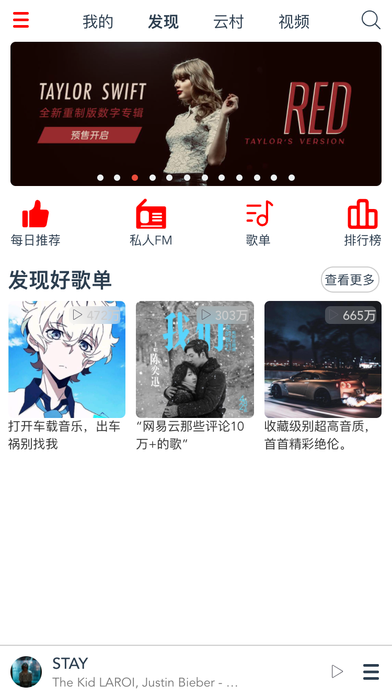
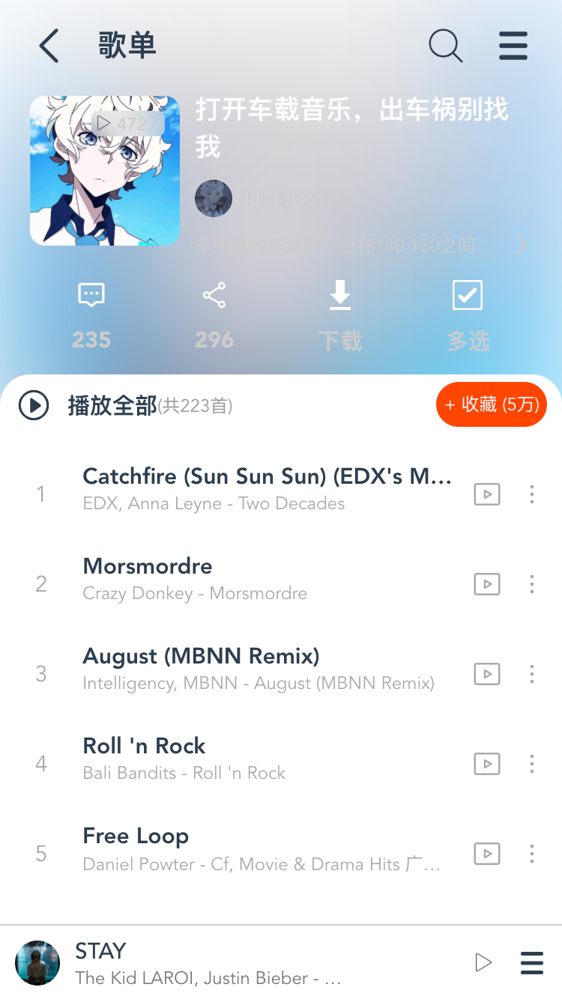

# musicapp

一个基于vue3的网易云音乐移动端的前端练习项目

后端接口由[网易云音乐 NodeJS 版 API](https://github.com/Binaryify/NeteaseCloudMusicApi)提供

目前所有组件均为js手写，下一个正式项目会用上element-plus

## 效果







## TODO

-   [ ] 完善播放页面
-   [ ] 完善首页下部的推荐歌单部分
-   [ ] 完善歌单中的异步惰性加载歌曲列表
-   [ ] 完善跑马灯标题的效果
-   [ ] more

## Project setup
```
npm install
```

### Compiles and hot-reloads for development
```
npm run serve
```

### Compiles and minifies for production
```
npm run build
```

### Customize configuration
See [Configuration Reference](https://cli.vuejs.org/config/).
